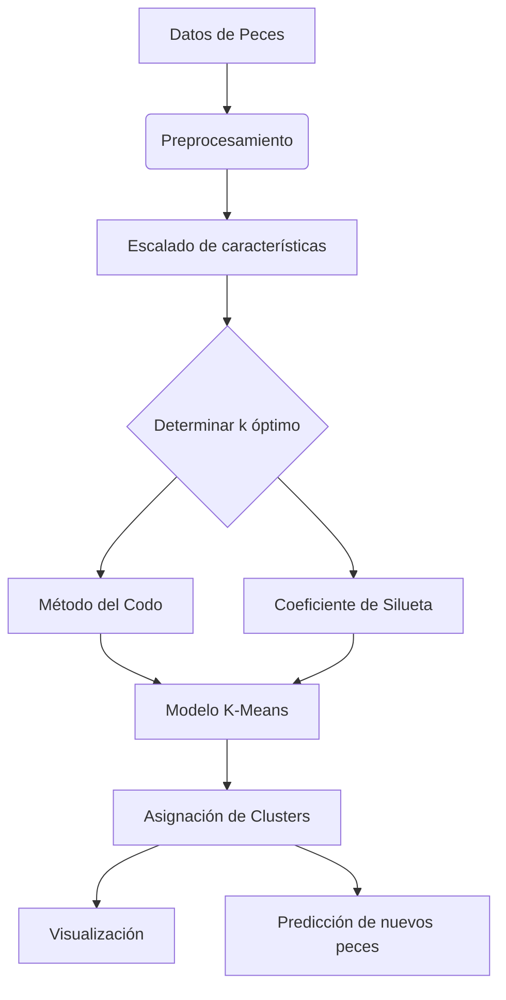

# Clustering de Especies de Peces con Machine Learning No Supervisado 🐟📊

Un sistema de agrupamiento automático que utiliza K-Means para clasificar especies de peces según sus características morfológicas (longitud, peso y relación peso/longitud).

## Características ✨

- **Agrupamiento inteligente**: Identifica patrones morfológicos en especies de peces  
- **Determinación automática de clusters**: Método del codo y coeficiente de silueta para encontrar el k óptimo  
- **Interfaz gráfica intuitiva**: Visualización de resultados y predicción de nuevos especímenes  
- **Análisis detallado**: Estadísticas por cluster y distribución de especies  
- **Sistema predictivo**: Incorpora nuevos peces y determina su cluster automáticamente  

## Tecnologías Utilizadas 🛠️

<p align="center">
  
  
  
  
  
</p>

## Cómo Funciona 🤖


## Instalacion local 🚀

``` bash
git clone https://github.com/tu-usuario/clustering-peces-ml.git
cd clustering-peces-ml
python -m venv venv
source venv/bin/activate  # Linux/Mac
venv\Scripts\activate    # Windows
pip install -r requirements.txt
python fish_cluster_app.py
```
## Estructura del Proyecto 📂
``` bash
clustering-peces-ml/
│
├── data/                   # Datasets de ejemplo
│   └── fish_data.csv       # Datos morfológicos de peces
│
├── src/                    # Código fuente
│   ├── fish_cluster_app.py # Aplicación principal
│   └── clustering.py       # Lógica de clustering
│
├── docs/                   # Documentación
│   └── analysis.ipynb      # Notebook de análisis
│
├── requirements.txt        # Dependencias
├── README.md               # Este archivo
└── LICENSE                 # Licencia MIT
```
## Dataset 🏋️‍♂️

``` bash
species,length,weight,w_l_ratio
Anabas testudineus,10.66,3.45,0.32
Lepomis macrochirus,15.20,4.80,0.32
Perca flavescens,22.10,7.50,0.34
```
## Uso de la Aplicación 🖥️

1. **Carga tu dataset** de características morfológicas
2. **Selecciona el número de clusters** (o déjalo determinar automáticamente)
3. **Explora los resultados**:
   - Visualización de clusters
   - Estadísticas por grupo
   - Distribución de especies
4. **Predice nuevos peces** ingresando sus características

## Contribuciones 🤝

1. **Haz fork del proyecto**  
   [](https://guides.github.com/activities/forking/)
   
2. **Configura tu entorno**:
   ```bash
   python -m venv venv
   source venv/bin/activate  # Linux/Mac
   venv\Scripts\activate    # Windows
   pip install -r requirements.txt
    ```
3. **Crea tu rama**:
  ``` bash
  git checkout -b feature/nueva-funcionalidad
  ```
4. **Haz commit y push**:
  ``` bash
  git commit -m 'feat: Agrega nueva funcionalidad'
  git push origin feature/nueva-funcionalidad
  ```
## Licencia 📜
MIT License


